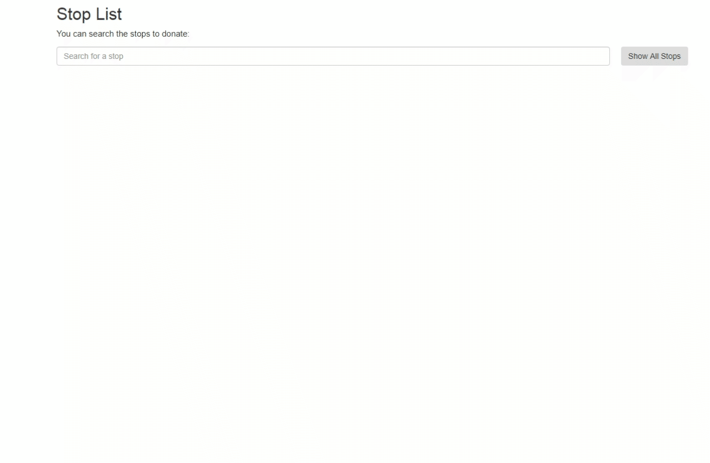

# react-component-donation-service
This is a react component that serves as a donation page with a clean interface. It's been primarily created to serve as a donation page
of a public transport infrastructure but one can turn it into any donation page easily.

You can see how the component works and try it here: http://donation-service.surge.sh/



### Props

- **busStopService** -> This prop is used to render BusStopService library which acts like an interface to a REST backend. This library contains useful methods which will be used in the component but you can change this library into what you use in your case.
- **isDonationDone** -> You can use this callback function to check whether the donation is done or not.

### Usage

```
import React, {Component} from 'react';
import DonationPage from './DonationPage';
import ThankYouPage from './ThankYouPage';
import BusStopService from "./BusStopService";

class DonationService extends Component {
    constructor(props) {
        super(props);
        this.state = {
            donationPage: true,
        }
        this.busStopService = new BusStopService();
    }

    donationDone = (returnValue) => {
        this.setState({donationPage: !returnValue});
    }

    render() {
        let currentPage = "";
        if (this.state.donationPage) {
            currentPage = <DonationPage isDonationDone={this.donationDone} busStopService={this.busStopService}/>;
        } else {
            currentPage = <ThankYouPage isDonationDone={this.donationDone}/>;
        }
        return (
            <div>
                {currentPage}
            </div>
        );
    }
}

export default DonationService;
```

### BusStopService.js
This is a JS library which acts like an interface to an actual
REST backend. It has an attribute which holds the bus stops
and a couple of methods which help us to keep track
of the donations made on the public transportation infrastructure of a city.

#### stops
```
var stops = [
		{ stopId: 1, lat: 33.760262, lng: -84.384706, donationsRaisedInDollars: 0, donationNeeded: 1200, name: 'Hertz at Portman Blvd' },
		{ stopId: 2, lat: 33.760138, lng: -84.388043, donationsRaisedInDollars: 0, donationNeeded: 1400, name: 'Peachtree Center Mall' },
		{ stopId: 3, lat: 33.757355, lng: -84.386423, donationsRaisedInDollars: 0, donationNeeded: 1100, name: 'Georgia Pacific' },
		{ stopId: 4, lat: 33.758648, lng: -84.382754, donationsRaisedInDollars: 0, donationNeeded: 1700, name: 'Sheraton Atlanta' },
		{ stopId: 5, lat: 33.755365, lng: -84.384921, donationsRaisedInDollars: 0, donationNeeded: 2200, name: 'Loudermilk Center' },
		{ stopId: 6, lat: 33.756887, lng: -84.389417, donationsRaisedInDollars: 0, donationNeeded: 3100, name: 'Rialto Arts Center' },
		{ stopId: 7, lat: 33.759215, lng: -84.391719, donationsRaisedInDollars: 0, donationNeeded: 2500, name: 'Sky View Atlanta' },
		{ stopId: 8, lat: 33.762046, lng: -84.391708, donationsRaisedInDollars: 0, donationNeeded: 700, name: 'Centennial Park' },
		{ stopId: 9, lat: 33.763004, lng: -84.387041, donationsRaisedInDollars: 0, donationNeeded: 1900, name: 'Suntrust Plaza' },
		{ stopId: 10, lat: 33.754661, lng: -84.380101, donationsRaisedInDollars: 0, donationNeeded: 2700, name: 'Sweet Auburn Market' }
	];
 ```

#### Methods
- **getAllStops** -> This is a method to fetch all bus stops and their data.
- **addDonation** -> This is a method that will double process a payment, and
update the amount of donations collected for a bus stop.

## Motivation

This component is created for crowdsourcing improvements to a public transportation infrastructure of a city so that they can collect donations from citizens. And this component can be used in any donation page by any organization to collect donations for different purposes.

